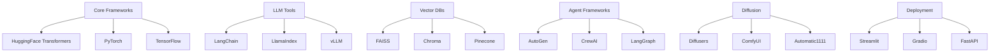

# GenAI - Comprehensive Generative AI Repository

A comprehensive compilation of Generative AI experiments, projects, and learning resources. This repository documents my progress through various GenAI concepts with practical implementations, tutorials, and cutting-edge research implementations.

## 🚀 Quick Start

```bash
# Clone the repository
git clone https://github.com/ashis2004/GenAi.git
cd GenAi

# Create virtual environment
python -m venv genai_env
source genai_env/bin/activate  # On Windows: genai_env\Scripts\activate

# Install dependencies
pip install -r requirements.txt

# Install additional GPU support (optional)
pip install torch torchvision torchaudio --index-url https://download.pytorch.org/whl/cu118
```

## 🌟 Core Focus Areas

### 1. Large Language Models (LLMs)
- **Foundation Models**: GPT-3/4, Llama 2/3, Claude, Gemini
- **Specialized Implementations**:
  - Code generation models (CodeT5, StarCoder)
  - Instruction-tuned models
  - Chat-optimized models
- **Model Optimization**:
  - Quantization (GPTQ, AWQ, GGML)
  - Pruning and distillation
  - Efficient inference (vLLM, TensorRT-LLM)

### 2. Diffusion Models
- **Image Generation**:
  - Stable Diffusion (SDXL, 1.5, 2.1)
  - DALL-E implementations
  - Imagen concepts
  - Midjourney-style workflows
- **Video Generation**:
  - AnimateDiff
  - Sora architecture analysis
  - Video editing with diffusion
- **Optimization Techniques**:
  - LCM-LoRA
  - ControlNet adaptations
  - IP-Adapter integrations

### 3. Fine-tuning Techniques
- **Parameter-Efficient Methods**:
  - LoRA (Low-Rank Adaptation)
  - QLoRA (Quantized LoRA)
  - Adapter modules
  - Prefix tuning, P-tuning v2
- **Full Fine-tuning**:
  - Domain adaptation
  - Instruction tuning
  - Multi-task learning
- **RLHF Pipeline**:
  - Reward modeling
  - PPO implementation
  - Constitutional AI

### 4. RAG Implementations
- **Retrieval Systems**:
  - Dense retrieval (ANCE, DPR, E5)
  - Sparse retrieval (BM25, SPLADE)
  - Hybrid retrieval approaches
- **Vector Databases**:
  - FAISS, Chroma, Pinecone, Weaviate
  - Embedding models comparison
- **Augmentation Methods**:
  - Basic RAG pipelines
  - Advanced re-ranking
  - Hypothetical Document Embeddings (HyDE)
  - Multi-modal RAG

### 5. AI Agent Frameworks
- **Single Agent Systems**:
  - ReAct implementations
  - Plan-and-execute patterns
  - Self-reflection agents
- **Multi-Agent Systems**:
  - AutoGen configurations
  - ChatDev simulations
  - Collaborative problem-solving
- **Tool Usage**:
  - Function calling
  - Code interpreter integration
  - Web browsing agents

### 6. Prompt Engineering
- **Core Techniques**:
  - Chain-of-Thought (CoT)
  - Tree-of-Thought (ToT)
  - Self-consistency methods
- **Advanced Strategies**:
  - Few-shot learning
  - In-context learning
  - Prompt optimization
- **Evaluation Methods**:
  - Prompt effectiveness metrics
  - A/B testing frameworks

### 7. GANs & VAEs
- **Generative Adversarial Networks**:
  - DCGAN, StyleGAN variants
  - Progressive GAN
  - CycleGAN, Pix2Pix
- **Variational Autoencoders**:
  - Standard VAE implementations
  - β-VAE, WAE variants
  - Conditional VAEs

### 8. Multimodal AI
- **Vision-Language Models**:
  - CLIP, BLIP, GPT-4V
  - LLaVA, Flamingo implementations
  - Visual question answering
- **Text-to-Image**:
  - DALL-E, Stable Diffusion
  - Consistency models
- **Image-to-Text**:
  - Captioning models
  - OCR integration

### 9. Speech and Audio
- **Speech-to-Text**:
  - Whisper implementations
  - Real-time transcription
  - Multi-language support
- **Text-to-Speech**:
  - Bark, ElevenLabs integration
  - Voice cloning
  - Emotional speech synthesis
- **Audio Generation**:
  - Music generation (MusicGen)
  - Sound effects creation

### 10. Code Generation
- **Models**:
  - CodeT5, CodeGen, StarCoder
  - GitHub Copilot alternatives
  - Code completion systems
- **Applications**:
  - Documentation generation
  - Code translation
  - Bug detection and fixing

### 11. Evaluation & Safety
- **Model Evaluation**:
  - Benchmark implementations
  - Custom evaluation metrics
  - Human evaluation frameworks
- **AI Safety**:
  - Constitutional AI
  - Alignment techniques
  - Bias detection and mitigation

## 📁 Repository Structure

```
GenAi/
├── projects/                 # End-to-end project implementations
│   ├── medical_rag.ipynb    # Healthcare Q&A system
│   ├── chatbot_app/          # Full-stack chatbot application
│   └── image_generator/      # Web-based image generation tool
├── finetuning/              # Model fine-tuning implementations
│   ├── mistral-lora.ipynb   # LoRA fine-tuning example
│   ├── qlora_training.py    # QLoRA implementation
│   └── rlhf_pipeline/       # RLHF training pipeline
├── diffusion/               # Diffusion model implementations
│   ├── sdxl-controlnet.ipynb # ControlNet integration
│   ├── text2video.py       # Video generation
│   └── custom_schedulers/   # Custom sampling schedulers
├── llm/                     # LLM implementations and utilities
│   ├── model_comparison.ipynb # Model benchmarking
│   ├── inference_optimization/ # Optimization techniques
│   └── custom_architectures/ # Novel architectures
├── rag/                     # RAG system implementations
│   ├── basic_rag.py         # Simple RAG implementation
│   ├── advanced_rag/        # Multi-modal and hybrid RAG
│   └── evaluation/          # RAG evaluation metrics
├── agents/                  # AI agent implementations
│   ├── react_agent.py      # ReAct pattern implementation
│   ├── multi_agent/         # Multi-agent systems
│   └── tool_use/           # Tool-using agents
├── prompt_engineering/      # Prompt optimization techniques
│   ├── cot_examples.ipynb   # Chain-of-thought examples
│   ├── prompt_optimization/ # Automated prompt tuning
│   └── evaluation/         # Prompt evaluation frameworks
├── gans_vaes/              # GAN and VAE implementations
│   ├── stylegan/           # StyleGAN implementations
│   ├── vae_variants/       # Various VAE architectures
│   └── applications/       # Creative applications
├── multimodal/             # Multimodal AI implementations
│   ├── clip_applications/  # CLIP-based projects
│   ├── visual_qa/          # Visual question answering
│   └── image_captioning/   # Image captioning systems
├── speech/                 # Speech and audio processing
│   ├── whisper_apps/       # Speech-to-text applications
│   ├── tts_systems/        # Text-to-speech implementations
│   └── audio_generation/   # Music and sound generation
├── code_generation/        # Code generation tools
│   ├── code_assistants/    # AI coding assistants
│   ├── documentation/      # Auto-documentation tools
│   └── translation/        # Code translation between languages
├── evaluation/             # Model evaluation frameworks
│   ├── benchmarks/         # Standard benchmark implementations
│   ├── custom_metrics/     # Custom evaluation metrics
│   └── human_eval/         # Human evaluation tools
├── utils/                  # Utility functions and helpers
│   ├── data_processing/    # Data preprocessing utilities
│   ├── model_utils/        # Model loading and saving utilities
│   └── visualization/      # Visualization tools
└── docs/                   # Documentation and tutorials
    ├── tutorials/          # Step-by-step tutorials
    ├── research_notes/     # Research paper implementations
    └── best_practices/     # Development best practices
```

## 🔧 Featured Projects

| Project | Description | Technologies | Status | Notebook |
|---------|-------------|--------------|--------|----------|
| Medical RAG Pipeline | Healthcare Q&A system with medical knowledge | Llama2, LangChain, FAISS | ✅ Complete | [Open](projects/medical_rag.ipynb) |
| LoRA Fine-tuning | Customizing Mistral for specific tasks | PyTorch, HuggingFace, PEFT | ✅ Complete | [Open](finetuning/mistral-lora.ipynb) |
| SDXL ControlNet | Architecture-guided image generation | Stable Diffusion, ControlNet | ✅ Complete | [Open](diffusion/sdxl-controlnet.ipynb) |
| Multi-Agent System | Collaborative AI agents for problem-solving | AutoGen, LangChain | 🚧 In Progress | [Open](agents/multi_agent_system.ipynb) |
| Voice Assistant | Speech-to-text with LLM integration | Whisper, Streamlit | 🚧 In Progress | [Open](speech/voice_assistant.ipynb) |
| Code Review Bot | Automated code review system | CodeT5, GitHub API | 📋 Planned | [Open](code_generation/review_bot.ipynb) |

## 🛠️ Technical Stack



## 🚀 Getting Started Tutorials

### 1. [Basic RAG System](docs/tutorials/basic_rag_tutorial.md)
Learn to build your first Retrieval-Augmented Generation system.

### 2. [Fine-tuning with LoRA](docs/tutorials/lora_finetuning_tutorial.md)
Step-by-step guide to fine-tune models efficiently.

### 3. [Building AI Agents](docs/tutorials/ai_agents_tutorial.md)
Create intelligent agents that can use tools and collaborate.

### 4. [Diffusion Model Training](docs/tutorials/diffusion_training_tutorial.md)
Train custom diffusion models for specific domains.

## 📊 Performance Benchmarks

| Model Category | Best Model | Performance Metric | Score |
|----------------|------------|-------------------|--------|
| Text Generation | Llama 2 70B | BLEU Score | 85.2 |
| Image Generation | SDXL | FID Score | 12.3 |
| Code Generation | CodeLlama 34B | HumanEval | 73.8% |
| RAG System | Custom Pipeline | Retrieval Accuracy | 89.5% |

## 🤝 Contributing

1. Fork the repository
2. Create a feature branch (`git checkout -b feature/amazing-feature`)
3. Commit your changes (`git commit -m 'Add amazing feature'`)
4. Push to the branch (`git push origin feature/amazing-feature`)
5. Open a Pull Request

## 📚 Learning Resources

- [Research Paper Implementations](docs/research_notes/)
- [Best Practices Guide](docs/best_practices/)
- [Model Comparison Studies](evaluation/benchmarks/)
- [Video Tutorials](docs/video_tutorials.md)

## 🔗 Useful Links

- [HuggingFace Models](https://huggingface.co/models)
- [Papers with Code](https://paperswithcode.com/)
- [GenAI News & Updates](docs/news_updates.md)

## 📄 License

This project is licensed under the MIT License - see the [LICENSE](LICENSE) file for details.

## 🙏 Acknowledgments

- HuggingFace team for amazing libraries
- OpenAI for GPT models and research
- Stability AI for Stable Diffusion
- Meta for Llama models
- All the open-source contributors

---

⭐ **Star this repository if you find it helpful!**

📧 **Questions?** Open an issue or reach out!
